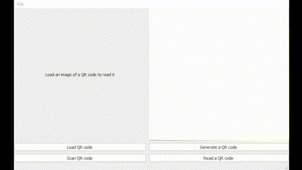

# QR Code Reader/Generator Application

This is a simple PyQt5 and OpenCV application for generating and reading QR codes. It allows users to load an image, generate a QR code from text, read QR codes from images and scan for QR codes using a camera.

## Features

- Load an image file (supports PNG, JPG, JPEG).
- Generate a QR code from entered text.
- Save the generated QR code as a PNG image.
- Read QR codes from loaded images.
- Read QR codes from a camera.

## Packages used:

- Python
- PyQt5
- OpenCV
- qrcode

## Installation

1. Clone the repository:
```bash
git clone https://github.com/ShayCohenn/QR-App.git
```
2. cd into the folder
```bash
cd qr_reader_generator
```
3. Create a virtual environment
```bash
python -m virtualenv env
```
4. Activate the virtual environment
```bash
.\env\Scripts\activate
```
5. Download the dependencies
```bash
pip install -r .\requirements.txt
```
6. Run the program!
```bash
python .\main.py
```

## How to use

### Basic usage:
<br>

### Scanning QR codes: 
